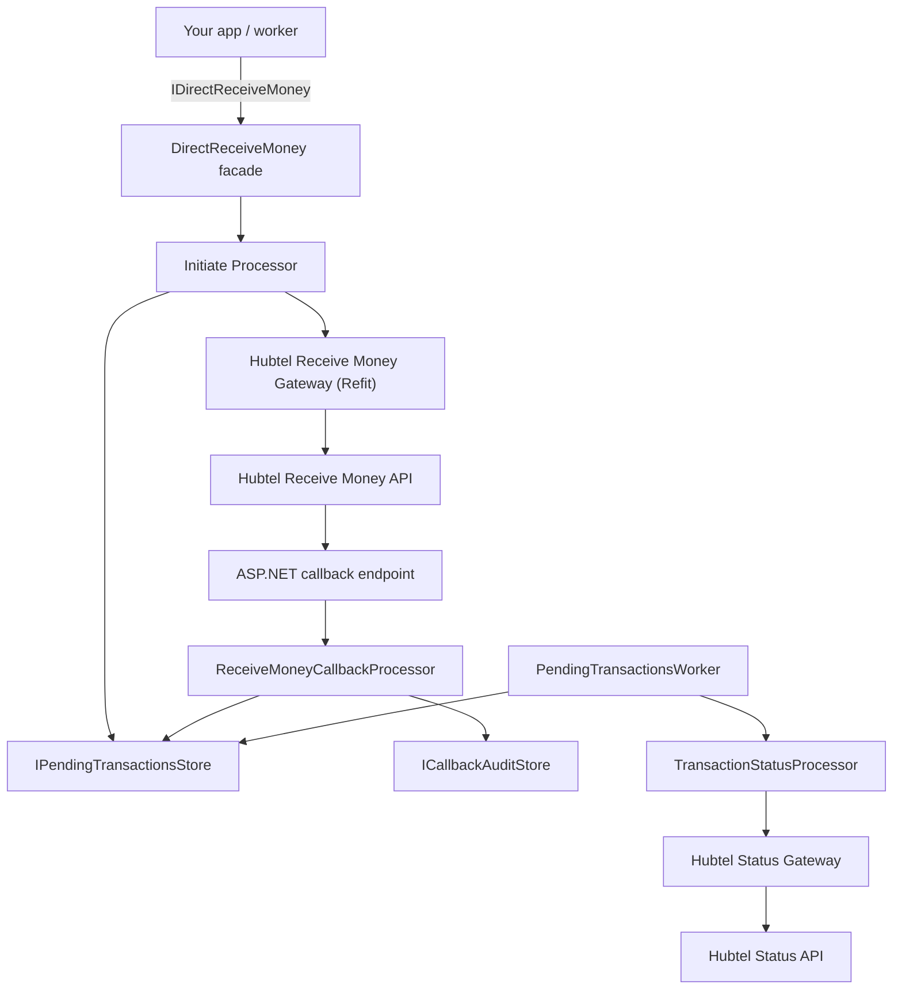
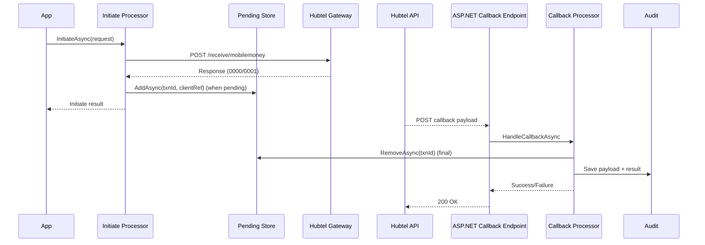

# Scynett.Hubtel.Payments

A lightweight .NET SDK that wraps Hubtel's Direct Receive Money endpoints (initiate, callbacks, and status checks) with opinionated validation, hosted background workers, and DI-friendly abstractions.

> Targets **.NET 9/10** and is published as the `Scynett.Hubtel.Payments` and `Scynett.Hubtel.Payments.AspNetCore` NuGet packages.

## Highlights

- **Unified facade** - `IDirectReceiveMoney` exposes `InitiateAsync`, `HandleCallbackAsync`, and `CheckStatusAsync`, each returning the SDK's `OperationResult<T>` for predictable success/failure envelopes.
- **Refit-powered gateways** - strongly typed clients for Hubtel's Receive Money + Transaction Status APIs with Basic-auth handler, configurable base addresses, and pluggable resilience.
- **Hosted background worker (opt-in)** - call `AddHubtelPaymentsWorker()` to run `PendingTransactionsWorker`, which polls stored transactions after a grace period so you always get a final state when callbacks are missed.
- **Ready-to-use storage** - ships with an in-memory `IPendingTransactionsStore` and extension points for Redis/SQL/custom stores. **PostgreSQL storage** available via the `Scynett.Hubtel.Payments.Storage.PostgreSql` package.
- **ASP.NET Core friendly** - a single `AddHubtelPayments(...)` registration wires validators, processors, hosted worker, and Refit clients; the optional ASP.NET Core package re-exports the same registration.

## Architecture at a glance

### Component view



### Initiate + callback sequence



## Packages

```bash
dotnet add package Scynett.Hubtel.Payments
dotnet add package Scynett.Hubtel.Payments.AspNetCore          # optional convenience wrapper
dotnet add package Scynett.Hubtel.Payments.Storage.PostgreSql  # PostgreSQL persistent storage
```

## Quickstart

### 1. Configure options & register services

```csharp
using Scynett.Hubtel.Payments.Options;
using Scynett.Hubtel.Payments.DependencyInjection;

var builder = WebApplication.CreateBuilder(args);

builder.Services.AddOptions<HubtelOptions>()
    .Bind(builder.Configuration.GetSection(HubtelOptions.SectionName));

builder.Services.AddOptions<DirectReceiveMoneyOptions>().Configure(o =>
{
    o.PosSalesId = "POS-123"; // Hubtel POS / Merchant ID
});

builder.Services.AddHubtelPayments();

builder.Services.AddHubtelPaymentsWorker(worker =>
{
    worker.CallbackGracePeriod = TimeSpan.FromMinutes(5);
    worker.PollInterval = TimeSpan.FromSeconds(30);
    worker.BatchSize = 200;
});

var app = builder.Build();
app.UseHubtelCorrelation();
app.Run();
```

The ASP.NET Core package exposes `services.AddHubtelPaymentsAspNetCore()` if you prefer a single call that forwards to the same registration; call `services.AddHubtelPaymentsWorker()` afterwards when you want the background polling worker.

### 2. Initiate a payment

```csharp
using Microsoft.AspNetCore.Mvc;
using Scynett.Hubtel.Payments.Application.Features.DirectReceiveMoney.Initiate;
using Scynett.Hubtel.Payments.DirectReceiveMoney;

[ApiController]
[Route("api/payments")]
public class PaymentsController : ControllerBase
{
    private readonly IDirectReceiveMoney _direct;

    public PaymentsController(IDirectReceiveMoney direct) => _direct = direct;

    [HttpPost("initiate")]
    public async Task<IActionResult> Initiate([FromBody] InitiateReceiveMoneyRequest request, CancellationToken ct)
    {
        var result = await _direct.InitiateAsync(request, ct);
        return result.IsSuccess ? Ok(result.Value) : BadRequest(result.Error);
    }
}
```

`InitiateReceiveMoneyRequest` matches Hubtel's payload (customer details, channel `mtn-gh | vodafone-gh | tigo-gh`, amount, callback URL, and client reference). Validation rules are enforced automatically.

### 3. Handle callbacks

```csharp
using Scynett.Hubtel.Payments.Application.Features.DirectReceiveMoney.Callback;

app.MapPost("/hubtel/callback", async (
    [FromBody] ReceiveMoneyCallbackRequest payload,
    IDirectReceiveMoney direct,
    CancellationToken ct) =>
{
    var result = await direct.HandleCallbackAsync(payload, ct);
    return result.IsSuccess ? Results.Ok() : Results.BadRequest(result.Error);
});
```

When the callback's response code is final, the worker removes the transaction from whatever `IPendingTransactionsStore` is registered.

### 4. (Optional) Manually query status

```csharp
using Scynett.Hubtel.Payments.Application.Features.DirectReceiveMoney.Status;

app.MapGet("/payments/{clientReference}/status", async (
    string clientReference,
    IDirectReceiveMoney direct,
    CancellationToken ct) =>
{
    var result = await direct.CheckStatusAsync(
        new TransactionStatusQuery(ClientReference: clientReference),
        ct);

    return result.IsSuccess ? Results.Ok(result.Value) : Results.BadRequest(result.Error);
});
```

The hosted worker already performs periodic checks for pending items, but you can expose manual status lookups whenever you need them.

### Handling failures

Every API returns `OperationResult<T>`, so expected payment outcomes (validation errors, declines, pending callbacks) never throw. Inspect the result before using it:

```csharp
var result = await _direct.InitiateAsync(request, ct);

if (!result.IsSuccess)
{
    _logger.LogWarning("Hubtel failure {Code} ({ProviderCode})", result.Error.Code, result.Error.ProviderCode);
    return Problem(detail: result.Error.Description, title: result.Error.Code);
}

var data = result.Value;
// continue with your flow
```

If you prefer exception-based flows, use the helper extension:

```csharp
using Scynett.Hubtel.Payments;

try
{
    var data = await _direct.InitiateAsync(request, ct).OrThrow();
    // success
}
catch (HubtelPaymentsException ex)
{
    // inspect ex.Error.Code / ProviderCode / Metadata and decide whether to retry
}
```

## Configuration reference

| Option | Description |
|--------|-------------|
| `HubtelOptions.ClientId` / `ClientSecret` | API credentials used by the Basic-auth delegating handler. |
| `HubtelOptions.MerchantAccountNumber` | Merchant POS/Sales ID (fallback when `DirectReceiveMoneyOptions.PosSalesId` is empty). |
| `HubtelOptions.ReceiveMoneyBaseAddress` / `TransactionStatusBaseAddress` | Override Hubtel endpoints (defaults to Hubtel production URLs). |
| `HubtelOptions.TimeoutSeconds` | Applied to both Refit `HttpClient` instances. |
| `DirectReceiveMoneyOptions.PosSalesId` | Explicit POS Sales ID for initiate/status calls. |
| `PendingTransactionsWorkerOptions.CallbackGracePeriod` | Minimum wait before contacting Hubtel after initiation. |
| `PendingTransactionsWorkerOptions.PollInterval` | Delay between worker batches (also used by `ExecuteAsync`). |
| `PendingTransactionsWorkerOptions.BatchSize` | Number of pending transactions processed per batch. |
| `PendingTransactionsCleanupOptions.RetentionPeriod` | How long to keep pending transactions before automatic cleanup (default 30 days). |
| `PendingTransactionsCleanupOptions.CleanupInterval` | How often the cleanup service runs (default every 6 hours). |

All options are `IOptions<T>` friendly and can be bound from configuration or populated programmatically.

## Pending transactions store

The SDK registers `IPendingTransactionsStore` via `InMemoryPendingTransactionsStore` by default. Swap it for a persistent implementation by registering your type *before* calling `AddHubtelPayments`:

```csharp
services.AddSingleton<IPendingTransactionsStore, RedisPendingTransactionsStore>();
services.AddHubtelPayments();
```

The worker simply calls `GetAllAsync`, `AddAsync`, and `RemoveAsync`, so any durable medium (SQL, Redis, Cosmos DB, etc.) works.

### PostgreSQL storage (recommended for production)

For production deployments, use the `Scynett.Hubtel.Payments.Storage.PostgreSql` package which provides durable storage that survives application restarts:

```bash
dotnet add package Scynett.Hubtel.Payments.Storage.PostgreSql
```

**Option 1: Programmatic configuration**

```csharp
using Scynett.Hubtel.Payments.Storage.PostgreSql;
using Scynett.Hubtel.Payments.DependencyInjection;

var builder = WebApplication.CreateBuilder(args);

// Register PostgreSQL storage BEFORE AddHubtelPayments()
builder.Services.AddHubtelPostgreSqlStorage(options =>
{
    options.ConnectionString = builder.Configuration.GetConnectionString("PostgreSql")!;
    options.SchemaName = "hubtel";           // default
    options.TableName = "pending_transactions"; // default
    options.AutoCreateSchema = true;         // creates schema/table on startup
    options.CommandTimeoutSeconds = 30;      // default
});

// Then register Hubtel payments and opt into the worker if needed
builder.Services.AddHubtelPayments();
builder.Services.AddHubtelPaymentsWorker();
```

**Option 2: Connection string only**

```csharp
builder.Services.AddHubtelPostgreSqlStorage(
    builder.Configuration.GetConnectionString("PostgreSql")!);
builder.Services.AddHubtelPayments();
builder.Services.AddHubtelPaymentsWorker();
```

**Option 3: Bind from configuration**

```csharp
builder.Services.AddHubtelPostgreSqlStorage(builder.Configuration);
builder.Services.AddHubtelPayments();
builder.Services.AddHubtelPaymentsWorker();
```

With `appsettings.json`:

```json
{
  "Hubtel": {
    "ClientId": "your-client-id",
    "ClientSecret": "your-client-secret",
    "Storage": {
      "PostgreSql": {
        "ConnectionString": "Host=localhost;Database=hubtel;Username=user;Password=pass",
        "SchemaName": "hubtel",
        "TableName": "pending_transactions",
        "AutoCreateSchema": true,
        "CommandTimeoutSeconds": 30
      }
    }
  }
}
```

#### PostgreSQL table schema

When `AutoCreateSchema` is enabled (default), the following schema is created automatically:

```sql
CREATE SCHEMA IF NOT EXISTS "hubtel";

CREATE TABLE IF NOT EXISTS "hubtel"."pending_transactions" (
    hubtel_transaction_id VARCHAR(100) PRIMARY KEY,
    client_reference VARCHAR(100),
    created_at_utc TIMESTAMPTZ NOT NULL DEFAULT NOW(),
    updated_at_utc TIMESTAMPTZ NOT NULL DEFAULT NOW()
);

CREATE INDEX IF NOT EXISTS ix_pending_transactions_created_at 
    ON "hubtel"."pending_transactions" (created_at_utc);
```

If you prefer to manage the schema manually, set `AutoCreateSchema = false` and ensure the table exists before starting the application.

#### PostgreSQL configuration options

| Option | Default | Description |
|--------|---------|-------------|
| `ConnectionString` | *(required)* | PostgreSQL connection string |
| `SchemaName` | `hubtel` | Schema name for the pending transactions table |
| `TableName` | `pending_transactions` | Table name for storing pending transactions |
| `AutoCreateSchema` | `true` | Whether to create schema/table on startup |
| `CommandTimeoutSeconds` | `30` | SQL command timeout |

## Public API surface

- `InitiateReceiveMoneyRequest` -> `OperationResult<InitiateReceiveMoneyResult>` (Hubtel response + decision metadata).
- `ReceiveMoneyCallbackRequest` -> `OperationResult<ReceiveMoneyCallbackResult>` (ensures payload is valid, removes pending when final).
- `TransactionStatusQuery` -> `OperationResult<TransactionStatusResult>` (supports client reference, Hubtel transaction ID, or network transaction ID).

Every command/result uses the shared `OperationResult<T>` + `Error` types so you can pattern match on `.IsSuccess` without exceptions.

### Error codes

| Error Code | When it is returned | Suggested Action |
|------------|--------------------|------------------|
| `DirectReceiveMoney.ValidationFailed` | Input payload failed FluentValidation checks. | Fix the request body and retry. |
| `DirectReceiveMoney.MissingPosSalesId` | No POS sales ID configured. | Set `HubtelOptions.MerchantAccountNumber` or `DirectReceiveMoneyOptions.PosSalesId`. |
| `DirectReceiveMoney.UnhandledException` | Unexpected exception during initiation (network, serialization, etc.). | Inspect `Error.Metadata["exception"]`, retry if transient. |
| `Hubtel.StatusCheckFailed` | Hubtel returned a non-`0000` response to the status check. | Examine `Error.ProviderCode` / `ProviderMessage`, retry or contact Hubtel. |
| `TransactionStatus.InvalidQuery` | Status query missing identifiers. | Provide at least one ID before retrying. |
| `TransactionStatus.Exception` | Exception occurred while polling Hubtel. | Inspect metadata and retry later. |
| `Hubtel.Callback.Validation` | Callback payload schema invalid. | Fix your callback endpoint serialization. |
| `Hubtel.Callback.Exception` | Exception thrown while handling callback. | Inspect metadata, log, and retry if possible. |

Each `Error` exposes `ProviderCode`, `ProviderMessage`, and optional metadata entries (e.g., exception type, HTTP status) so you can make data-driven retry decisions and log the original Hubtel response.

## Testing & samples

The repository includes extensive unit and WireMock-backed integration tests under `tests/Scynett.Hubtel.Payments.Tests`. Use them as a reference for custom stubs, DI bootstrapping, or integration pipelines.

## Versioning & releases

This SDK follows [Semantic Versioning](https://semver.org/) with tag-driven releases. Annotated git tags that start with `v` (for example `v1.4.0` or `v1.4.0-rc.1`) determine the NuGet package version produced by `dotnet pack`. See [CONTRIBUTING.md](CONTRIBUTING.md#releasing) for the full release checklist and tagging instructions.

## Limitations / roadmap

- Only Direct Receive Money + transaction status APIs are implemented; payouts and other Hubtel surfaces are not yet supported.
- The default `IPendingTransactionsStore` is in-memory. For production you should provide a Redis/SQL implementation so pending transactions survive restarts.
- Error codes and metadata are still evolving during the `0.x` release train; expect breaking changes until `1.0`.
- Resilience policies are currently opt-in; future releases will expose first-class configuration for retries/circuit breaking.
- Additional ASP.NET Core helpers (attribute routing, outbox samples) are planned but not yet available.

## License

MIT


